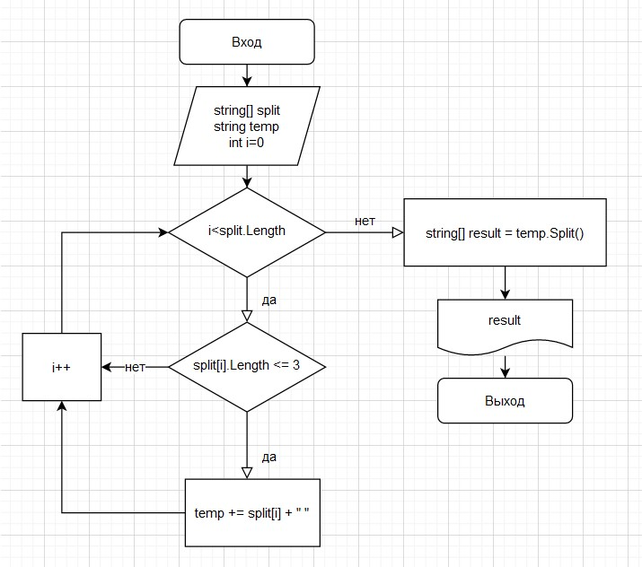

**Задача** 

написать программу, которая из имеющегося массива строк формирует массив из строк, длина которых меньше или равно 3 символа. Первоночальный массив можно ввести с клавиатуры или задать на старте выполнения алгоритма.
При решениии не рекомендуется пользоваться коллекциями, лучше обойтись исключительно массивами.


**Решение** 

*Блок-схема* 




*Код*

1. чтение массива строк
```csharp
Console.Write("Enter strings (separated by a space): ");
string values = Console.ReadLine();

string[] split = values.Split(' ', System.StringSplitOptions.RemoveEmptyEntries);
```
2. запись через пробел в новую строку всех строк, удовлетворяющих условию
```csharp
string temp = string.Empty;
for(int i =0; i<split.Length; ++i)
    if(split[i].Length <= 3)
        temp += split[i] + " ";
```
3. разбиение полученной новой строки на массив строк
```csharp
string[] result = temp.Split(' ', System.StringSplitOptions.RemoveEmptyEntries);

for(int i =0; i<result.Length; ++i)
    Console.Write($"{result[i]} ");
```

*Примечание*

Сначала реализовал через два цикла: в первом - просчитал количество строк, удовлетворяющих условию; во втором - в созданный новый массив "сложил" строкии, удовлетворяющие условию. Но иметь практически два одинаковых цикла мне показалось не оптимально с точки зрения прозрачности и дальнейше поддержки.